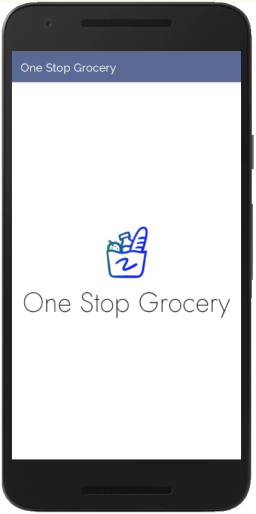
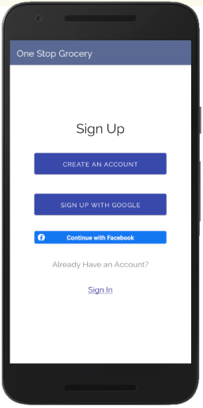
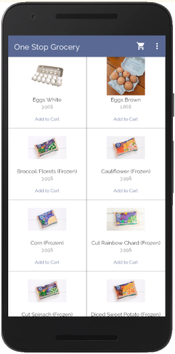
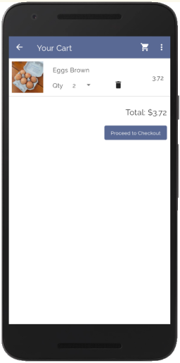
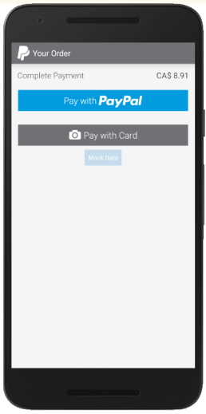

# One Stop Grocery

One Stop Grocery is a mobile application for online grocery shopping written in Java.

The application follows a [Model-View-ViewModel](https://en.wikipedia.org/wiki/Model%E2%80%93view%E2%80%93viewmodel) (MVVM) architecture pattern.
 
 

  

## Feature Specifications

**Sign-up and Login** 

Users can register for an account through the sign up option with their full name, username, email address and password. They can open a session with an existing account through the login option with their email address and password that is used for registration.

  

**Social Login Integration**

Social Login Integration makes it easy to log in to our app through the user’s existing social media account. It provides an API to allow our application to authenticate users using the credentials to get all the needed details. In our application, we have used two major social login providers: Google and Facebook.

**Product Catalog**

The product catalog provides lists of essential product details for a buyer including product descriptions, features, price, weight, availability, and customer reviews. It also helps a buyer to make a purchase decision. 

  

**Shopping Carts and Payments**

An online shopping cart is a virtual equivalent that puts the user's goods into the cart and drives it to the payment gateway. We are using the PayPal payment gateway for our application which allows a user to pay either users’ PayPal account or Credit/Debit cards.

  

## Technical Extensions Implemented

**Google Login Integration**

Google Login Integration allows users to sign up with their Google accounts to retrieve profile information such as email, name, etc. Once a user clicks on “Sign up with Google” on the application, it starts the sign-in intent which prompts the user to sign in with a Google account. It also checks If the user is already signed in with their Google accounts on that device.

**Facebook Login Integration**

Facebook Login Integration allows users to sign up with their Facebook accounts to retrieve profile information. Since Facebook does not allow retrieving any data in development mode, the “Sign up with Google” button on the application works only for sign in and sign out for registered users for the application.

**Paypal Checkout Integration**

PayPal Checkout Integration allows a user to make payments for their purchase through Paypal. When the “Confirm and Pay” button is clicked on the application, a call to the PayPal API is made to set up the payment for the user. This starts a new PayPal Activity where a user can sign in with their PayPal account and make a payment.

  

**Room persistence library**

The [Room](https://developer.android.com/jetpack/androidx/releases/room?gclid=Cj0KCQjws4aKBhDPARIsAIWH0JV-b8aWR805LIjUPqD81JPM1OJKBI0Oq5-NP6bq0aIMjmKg5gccYVkaAsU8EALw_wcB&gclsrc=aw.ds) library provides an abstraction layer over SQLite and provides several benefits including:
- SQL validation at compile time
- Automatic updates to SQL queries when your schema changes
- Less boilerplate from converting between SQL queries and Java objects
